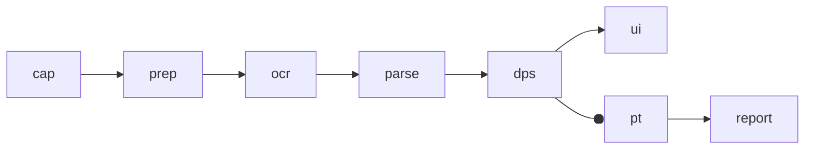

# 아이온2 실시간 라이브 OCR 기반 딜 미터기 가능성 평가

## Executive Summary
전투로그 ROI 캡처→OCR→파싱으로 DPS 산출이 가능하며, 구현도 공개돼 있다. citeturn2view2 다만 entity["company","PLAYNC","ncsoft platform"] 운영정책의 “비인가 프로그램” 정의와 프로세스 감지 기반 접속 제한 공지로 운영 리스크가 존재한다. citeturn6view3turn6view4 entity["company","엔씨소프트","korean game publisher"]의 개인 딜미터기 도입 공식화로 외부 수요는 변동 가능. citeturn7search10

## 조사 범위와 방법
공식·오픈소스·커뮤니티 사례(팁 포함)를 비교했다. API·캡처/오버레이 허용은 **미확인**.

## 기술적 가능성 평가
파이프라인: cap→prep→ocr→dedup(해시캐시)→parse(사전보정)→dps. citeturn2view2  
캡처: OS 영역(권장) 또는 게임 스냅샷 감시(팁). citeturn6view1  
성능: 1장 1,000ms 사례가 있어 스트리밍 2~5FPS 또는 라인배치(변경 시만 OCR)가 현실적. citeturn1search3

## 사례 분석
오픈소스/커뮤니티 사례 요약. citeturn2view2turn9view2turn2view4turn1search6  
|사례|흐름|특징|
|---|---|---|
|OCR 미터(아이온2)|ROI→OCR→regex→DPS|중복프레임 무시·UI 조건 민감|
|OCR DPS PoC(타게임)|UI숫자→OCR→평균DPS|노이즈/리셋 처리 언급|
|패킷 미터(비교)|pcap→파싱→UI|드라이버/관리자 필요·리스크↑|

## 정확도 변수와 정량 추정
변수: UI/DPI·배경, 한/영, 모션, 캡처, 탐지(미확인), PII.  
추정: 숫자 OCR 90~98%(양호)/60~85%(불량), 80~90% 언급 사례. citeturn1search7 지연 150~600ms, 최악 1~2s.

## 아키텍처 제안과 리스크·비용·결론
권장: **로컬 cap+로컬 OCR** 기본, 서버는 세션id로 동기화, 집계값만 업로드.  

리스크/완화: 비인가 프로그램 금지·출처 불명 SW의 계정/개인정보 노출 경고. citeturn6view3turn5search8 → 무개입(메모리/패킷/입력 금지), 별도창 UI, ROI 강제·마스킹, 샌드박스·로컬저장+동의.  
MVP/테스트: 2인 6~8주(오픈소스 OCR 가정); 1k~3k 데이터, 지표 CER/WER·DPS오차·P95지연, 전처리 A/B.  
판단: **가능성 중간~높음**. 성공 조건은 “정지 리스크 최소화”와 “공식 개인 딜미터 이후 차별화(리포트/코칭)”이다.